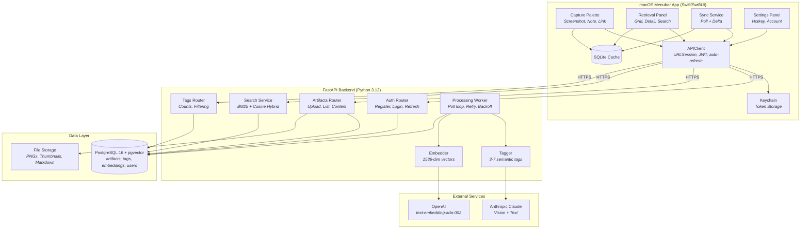

<div align="center">
<pre>
  _                     _ _      
 | |                   | | |     
 | |__  _   _ _ __   __| | | ___ 
 | '_ \| | | | '_ \ / _` | |/ _ \
 | |_) | |_| | | | | (_| | |  __/
 |_.__/ \__,_|_| |_|\__,_|_|\___|
                                 
-----------------------------------------------------------------------------------------
Capture fleeting inspiration and retrieve it through
reverse chronological and semantic views.

</pre>


</div>

## Introduction

Bundle is a macOS-native menubar app for capturing fleeting inspiration: screenshots, quick notes, and links. Artifacts are auto-tagged via LLM (Anthropic Claude for vision/text, OpenAI for embeddings) and retrievable through a reverse-chronological grid or semantic search powered by pgvector hybrid ranking (BM25 + cosine similarity).


https://github.com/user-attachments/assets/8cf2de95-b0c2-4590-9a47-1f06a67133a6


## Technology Stack

- **macOS App:** Swift 6, SwiftUI, MenuBarExtra, AppKit (region capture, floating panels)
- **Backend:** Python 3.12, FastAPI, asyncpg, Pydantic
- **Database:** PostgreSQL 16 + pgvector (source of truth), SQLite (local cache)
- **LLM:** Anthropic Claude (vision + text tagging), OpenAI (text-embedding-ada-002)
- **Auth:** JWT (access + refresh), bcrypt, Keychain storage
- **Infrastructure:** Docker Compose, Cloudflare Tunnels, single-VPS deployment
- **Tooling:** uv workspaces, Just, Ruff, Pyright, lefthook

## Architecture



| Flow | Path |
|------|------|
| Capture | Hotkey → Palette → Screenshot/Note/Link → SQLite → Backend upload |
| Processing | Upload → pending → Worker picks up → LLM tags + embeds → completed |
| Retrieval | Panel opens → Sync delta → Grid (chronological) or Search (hybrid) |
| Search | Query → BM25 text (0.4) + pgvector cosine (0.6) → ranked results |

## Usage

### Prerequisites

- macOS 14+ (Sonoma)
- [uv](https://docs.astral.sh/uv/) (Python package manager)
- [Docker](https://docs.docker.com/get-docker/) and Docker Compose
- [Just](https://github.com/casey/just) command runner
- [dbmate](https://github.com/amacneil/dbmate) (database migrations)
- [Xcode](https://developer.apple.com/xcode/) or Swift 6 toolchain (for macOS app)

### Getting Started

```bash
# Copy environment config
cp .env.example .env
# Fill in ANTHROPIC_API_KEY and OPENAI_API_KEY

# Install Python dependencies
uv sync

# Start PostgreSQL with pgvector
just dev-db

# Run database migrations
just db-migrate

# Start the backend with hot reload
just dev
```

### Building the macOS App

```bash
# Build only
just macos-build

# Build, sign, and run (recommended)
just macos-run
```

The app runs as a menubar icon (no Dock presence). Default capture hotkey: **⌘⇧B**.

### Code Signing (Required for Hotkey)

The global hotkey uses a CGEvent tap, which requires **Accessibility permissions**. macOS ties these permissions to the code signature: unsigned rebuilds are treated as new apps, revoking the permission each time.

To fix this, create a self-signed certificate once:

1. Open **Keychain Access**
2. Menu: **Keychain Access → Certificate Assistant → Create a Certificate**
3. Name: `Bundle Dev`
4. Identity Type: **Self Signed Root**
5. Certificate Type: **Code Signing**
6. Click Create

Then use `just macos-run` which signs the binary with this identity. Grant Accessibility permission once (System Settings → Privacy & Security → Accessibility) and it persists across rebuilds.

Alternatively, open in Xcode (`open apps/macos/Package.swift`), sign in with your Apple ID under Xcode → Settings → Accounts, and build from there.

### Available Commands

| Command | Description |
|---------|-------------|
| `just dev` | Start PostgreSQL + API with hot reload |
| `just dev-db` | Start only PostgreSQL |
| `just dev-down` | Stop development services |
| `just lint` | Run ruff check + pyright |
| `just format` | Run ruff formatter |
| `just test` | Run all Python tests |
| `just db-migrate` | Apply database migrations |
| `just db-new <name>` | Create a new migration |
| `just db-rollback` | Rollback last migration |
| `just docker-build` | Build production Docker image |
| `just macos-build` | Build macOS app (debug) |
| `just macos-run` | Build, sign, and run macOS app |

## Key Features

| Feature | Description |
|---------|-------------|
| **Screenshot Capture** | Global hotkey → region selection overlay → PNG + thumbnail |
| **Note Capture** | Floating monospace editor, Cmd+Enter to save |
| **Link Capture** | URL input with clipboard pre-fill, favicon display |
| **Auto-Tagging** | LLM generates 3-7 semantic tags per artifact |
| **Hybrid Search** | BM25 full-text + pgvector cosine similarity ranking |
| **Tag Filtering** | Scrollable pill bar for instant local filtering |
| **Delta Sync** | 30s polling with exponential backoff, initial progress bar |
| **Processing Pipeline** | Async worker with retry, backoff, status badges |
| **Artifact Detail** | Zoomable screenshots, rendered markdown, link browser open |
| **Hotkey Config** | Recordable shortcut with conflict detection |

## Deployment

Bundle runs on a single VPS with Cloudflare Tunnels for HTTPS ingress.

```bash
# Build and deploy
just docker-build
scripts/deploy.sh
```

The deploy script handles image build, container restart with rollback on health check failure, and zero-downtime via Cloudflare tunnel reconnection.

## Configuration

All configuration is via environment variables (see `.env.example`):

| Variable | Purpose |
|----------|---------|
| `DATABASE_URL` | PostgreSQL connection string |
| `JWT_SECRET` | HMAC signing key (32+ chars) |
| `ANTHROPIC_API_KEY` | Claude API for vision + text tagging |
| `OPENAI_API_KEY` | Embeddings (text-embedding-ada-002) |
| `ARTIFACTS_PATH` | File storage directory |
| `SENTRY_DSN` | Error tracking (optional) |
